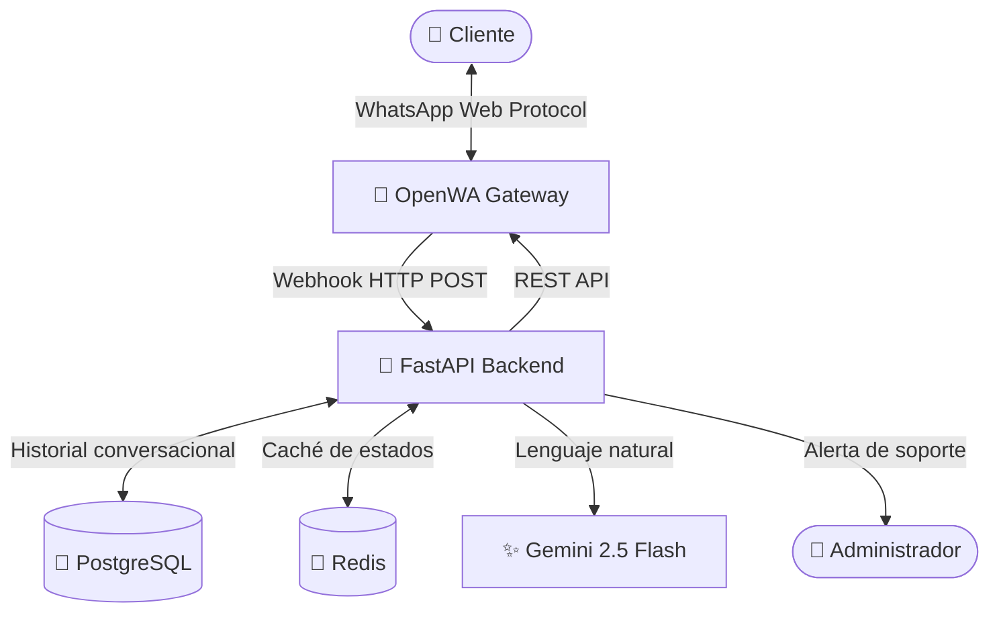

# 🤖 WhatsApp Automation Backend (FastAPI + OpenWA + Gemini AI)

Bot de WhatsApp de nivel profesional con inteligencia artificial, persistencia relacional, caché en Redis y sistema de transferencia a agente humano con silencio del bot.

---

## 🏗️ Arquitectura del Ecosistema



| Componente | Tecnología | Rol |
|---|---|---|
| **Gateway** | OpenWA (Docker) | Emula WhatsApp Web con Chromium/Puppeteer |
| **Backend** | FastAPI + Python 3.13 | Webhook, lógica de negocio, API |
| **Base de Datos** | PostgreSQL 16 | Historial de mensajes y sesiones |
| **Caché** | Redis 7 | Estados de conversación en RAM con persistencia |
| **Inteligencia Artificial** | Gemini 2.5 Flash | Respuestas en lenguaje natural (fallback) |

---

## ⚡ Características Implementadas

### Fase 1 — Bot de Menús Interactivos
- Árbol de menús jerárquico navegable con números y palabras clave
- Enrutador de estados con soporte híbrido: texto, botones nativos y listas

### Fase 2 — IA + PostgreSQL
- Fallback a **Gemini 2.5 Flash** cuando el usuario escribe lenguaje natural fuera de menús
- Persistencia completa del historial de mensajes en **PostgreSQL** (roles `user` / `assistant`)
- Contexto conversacional: la IA recibe el historial para respuestas coherentes

### Fase 3 — Redis Cache
- Los estados de sesión se leen desde **RAM (Redis)** → latencia mínima
- En caso de *cache miss*, se sincroniza desde PostgreSQL automáticamente
- Redis persiste en disco con `appendonly yes` para sobrevivir reinicios

### Fase 4 — Alertas y Takeover Humano
- Al seleccionar "Hablar con un Agente", el bot envía una **alerta al Administrador** vía WhatsApp con el nombre y chat del cliente
- El bot entra en **modo silencio absoluto** (`human_agent`): no responde ni interfiere
- **Auto-liberación interactiva**: el cliente o el admin pueden escribir `!menu` para reactivar el bot
- **Auto-liberación por inactividad**: tras 60 minutos sin mensajes, el bot se reactiva automáticamente

---

## 🌳 Estructura de Menús

```
hola / menu / inicio
└── 1️⃣  Catálogo de Productos
│   ├── 11  💻 Tecnología y Computación
│   ├── 12  📱 Celulares y Accesorios
│   └── 13  🎧 Audio y Sonido
├── 2️⃣  Soporte Técnico
│   ├── 21  💬 Hablar con un Agente Humano  ← activa modo silencio + alerta admin
│   └── 22  📧 Dejar un Correo de Soporte
└── 3️⃣  Preguntas Frecuentes
    ├── 31  🚚 Tiempos de Envío
    ├── 32  💳 Métodos de Pago
    └── 33  🔄 Política de Devoluciones

0  →  Volver al Menú Principal (desde cualquier punto)
!menu  →  Salir del modo agente humano y reactivar el bot
```

---

## 🚀 Cómo Iniciar el Ecosistema

### 1. Requisitos Previos
- **Docker** y **Docker Compose** instalados y en ejecución
- **Python 3.13+** y la herramienta **`uv`** instalados localmente

### 2. Configurar Variables de Entorno
Copia el archivo de ejemplo y edítalo con tus credenciales:

```bash
cp .env.example .env
```

Valores necesarios en `.env`:

```env
# API Key de Google AI Studio (https://aistudio.google.com/app/apikey)
GOOGLE_API_KEY=tu_clave_de_google_aqui

# Número del administrador en formato internacional (sin + ni espacios)
# Ejemplo: 50212345678  (Guatemala) o 5491112345678 (Argentina)
ADMIN_PHONE_NUMBER=tu_numero_aqui
```

### 3. Levantar todos los servicios con Docker

```bash
docker compose up -d --build
```

Esto inicia en un solo comando:
- `openwa-gateway` — Gateway de WhatsApp
- `auto-whats-app` — Backend Python (FastAPI)
- `whatsapp-postgres-db` — Base de datos PostgreSQL
- `whatsapp-redis-cache` — Caché de estados Redis

### 4. Vincular tu Teléfono (primera vez)

Si es la primera vez, necesitas escanear el código QR:

```bash
uv run test-send
```

Esto generará `codigo_qr.png` en la raíz. Escanéalo desde WhatsApp → **Dispositivos vinculados**.

### 5. Registrar el Webhook

Asegúrate de que el gateway apunte al backend:

```bash
uv run python scripts/register_webhook.py
```

---

## 🔄 Aplicar Cambios al Contenedor

Cada vez que modificas el código fuente o archivos de configuración (`.env`, `Dockerfile`, `docker-compose.yml`), debes reconstruir y reiniciar:

```bash
docker compose up -d --build
```

> **Nota:** Si solo cambias código Python dentro del contenedor (sin modificar dependencias), también puedes hacer `docker compose restart app` para un reinicio rápido sin reconstruir la imagen.

---

## 🧪 Tests

Ejecuta la suite completa de tests unitarios:

```bash
uv run pytest tests/ -v
```

Los tests cubren:
- Flujo de menús y navegación
- Lógica de soporte y activación del modo agente
- Silencio del bot (`human_agent`)
- Liberación interactiva del bot con `!menu`
- Auto-liberación por TTL de inactividad

---

## 📁 Estructura del Proyecto

```
auto_whats/
├── src/
│   ├── main.py          # FastAPI app, webhook, enrutador de estados, takeover
│   ├── agent.py         # Integración con Gemini 2.5 Flash (lenguaje natural)
│   ├── agent_graph.py   # Grafo LangGraph (LangServe playground)
│   ├── cache.py         # Funciones Redis (get/set estados de sesión)
│   ├── client.py        # Cliente HTTP para OpenWA REST API
│   ├── database.py      # Configuración SQLAlchemy async + PostgreSQL
│   └── models.py        # Modelos ORM: UserSession, MessageHistory
├── tests/
│   └── test_webhook.py  # Suite de tests unitarios (11 tests)
├── scripts/
│   └── register_webhook.py  # Script para registrar el webhook en OpenWA
├── docker-compose.yml   # Orquestación: OpenWA + FastAPI + PostgreSQL + Redis
├── Dockerfile           # Imagen Python 3.13-slim con uv
├── pyproject.toml       # Dependencias y scripts del proyecto
└── .env                 # Variables de entorno (no se versiona)
```

---

## 🛠️ Resolución de Problemas

### Error `SingletonLock` al iniciar OpenWA
Chromium se cerró abruptamente y dejó un archivo de bloqueo:
```powershell
Remove-Item -Path ./openwa_data/sessions/session-default/SingletonLock -Force
docker compose restart openwa-gateway
```

### El bot no responde a los mensajes
1. Verifica que el backend esté corriendo: `docker compose ps`
2. Revisa los logs del backend: `docker compose logs app -f`
3. Registra de nuevo el webhook: `uv run python scripts/register_webhook.py`

### Error de API de Gemini (`404 NOT FOUND`)
Asegúrate de que `GOOGLE_API_KEY` está correctamente configurado en `.env` y de que la imagen está reconstruida con `docker compose up -d --build`.

### El administrador no recibe alertas de soporte
- Verifica que `ADMIN_PHONE_NUMBER` en `.env` tiene el formato internacional correcto (sin `+` ni espacios, ej: `50212345678`).
- Confirma que el número está vinculado a una cuenta activa de WhatsApp.
- Reconstruye el contenedor tras modificar el `.env`.

---

## 🤖 LangServe Playground

El agente de IA está expuesto como API REST y cuenta con un playground interactivo:

```
http://localhost:8000/agent/playground/
```

Úsalo para probar respuestas de Gemini directamente desde el navegador, sin necesidad de enviar mensajes por WhatsApp.
