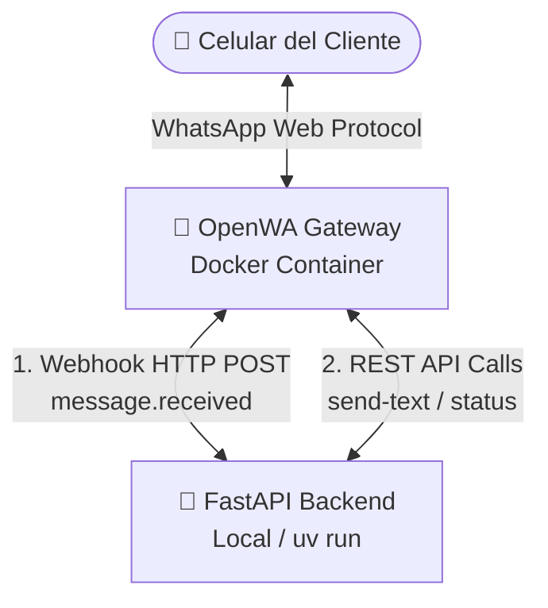

# 🤖 WhatsApp Automation Backend & Gateway (FastAPI + OpenWA)

¡Bienvenido al ecosistema de automatización profesional de WhatsApp! Este proyecto integra un **Gateway auto-hospedado de OpenWA** ejecutándose en Docker con un potente **Backend asíncrono en Python con FastAPI**, diseñado para procesar interacciones ricas e inteligentes de forma robusta.

---

## 🏗️ Arquitectura del Ecosistema

El proyecto utiliza una arquitectura desacoplada para máxima estabilidad y rendimiento:



1. **OpenWA Gateway (Docker)**: Corre un navegador sin cabeza (Chromium/Puppeteer) que emula una sesión de WhatsApp Web activa.
2. **FastAPI Backend (Python)**: Escucha de forma asíncrona los eventos del webhook y gestiona los flujos de conversación, base de datos y lógica del negocio.

---

## ⚡ Características Implementadas

* **Enrutador de Estados e Interacciones Híbrido**: Lógica de estados en memoria (`USER_STATES`) que guía al usuario de forma interactiva a través de árboles de decisiones numéricos y de palabras clave.
* **Soporte Dual en Webhooks**: Compatible tanto con respuestas textuales del cliente (`"1"`, `"hola"`) como con clics estructurados de botones y listas nativas (`selectedButtonId` y `listResponse.rowId`), haciéndolo 100% compatible con futuras migraciones a la API de WhatsApp Cloud oficial.
* **Auto-Reconexión y Recuperación de Fallos**: Lógica automática para detectar bloqueos de Chromium (`SingletonLock` en volúmenes Docker) y recuperarlos limpiamente usando comandos `/start`.
* **Registro Dinámico de Webhooks**: Configurado para escuchar de forma activa el evento `"message.received"` requerido por las versiones modernas del gateway.

---

## 🌳 Estructura de Menús Interactivos

El bot cuenta con un flujo jerárquico totalmente operativo:

* **Menú Principal (`hola` / `menú`)**
    * **1️⃣ Catálogo de Productos** 📦
        * `11` ➔ 💻 Tecnología y Computación (Laptops, periféricos, etc.)
        * `12` ➔ 📱 Celulares y Accesorios (Smartphones, cargadores, etc.)
        * `13` ➔ 🎧 Audio y Sonido (Audífonos, bocinas, etc.)
    * **2️⃣ Soporte Técnico** 🛠️
        * `21` ➔ 💬 Hablar con un Agente Humano (Transferencia inmediata)
        * `22` ➔ 📧 Dejar un Correo de Soporte (`soporte@tuempresa.com`)
    * **3️⃣ Preguntas Frecuentes (FAQ)** ❓
        * `31` ➔ 🚚 Tiempos de Envío (Locales, Nacionales, Internacionales)
        * `32` ➔ 💳 Métodos de Pago (Tarjetas, Transferencia, PayPal)
        * `33` ➔ 🔄 Políticas de Devoluciones (Garantía de 30 días)
    * **Atajo Global (`0`)**: Regresa al usuario al Menú Principal en cualquier momento.

---

## 🚀 Cómo Iniciar el Ecosistema

### 1. Requisitos Previos
* **Docker y Docker Compose** instalados y ejecutándose.
* **Python 3.13+** y la herramienta **`uv`** instalados localmente.

### 2. Levantar la Infraestructura de Docker
Levanta el contenedor de OpenWA que almacena la sesión Puppeteer:
```bash
docker compose up -d openwa-gateway
```

### 3. Iniciar el Backend FastAPI
Ejecuta el servidor FastAPI con recarga automática:
```bash
uv run auto-whats
```
El backend se iniciará en `http://localhost:8000` y resolverá dinámicamente tu ID de sesión buscando el nombre `"default"`.

### 4. Vincular tu Teléfono (Si es la primera vez)
Si necesitas escanear el código QR para vincular tu teléfono, corre el asistente interactivo:
```bash
uv run test-send
```
Esto generará un archivo `codigo_qr.png` en la raíz del proyecto. Escanéalo desde tu WhatsApp (Dispositivos vinculados) y el asistente te confirmará en pantalla en cuanto esté conectado en línea.

---

## 🛠️ Resolución de Problemas Frecuentes

### 1. Error `Internal Server Error (500)` al Iniciar la Sesión
* **Causa**: Chromium se cerró abruptamente en el reinicio anterior y dejó un archivo de bloqueo en el volumen.
* **Solución**: Elimina el archivo `SingletonLock` que se encuentra en la carpeta persistente y reinicia el servicio:
  ```powershell
  Remove-Item -Path ./openwa_data/sessions/session-default/SingletonLock -Force
  docker compose restart openwa-gateway
  ```

### 2. El Bot no Responde a los Mensajes
* **Causa 1**: El backend de FastAPI está apagado. Inícialo con `uv run auto-whats`.
* **Causa 2**: El webhook del gateway apunta a un puerto o evento incorrecto. Ejecuta el script de registro para asegurar la suscripción correcta a `"message.received"`:
  ```bash
  uv run python scripts/register_webhook.py
  ```
